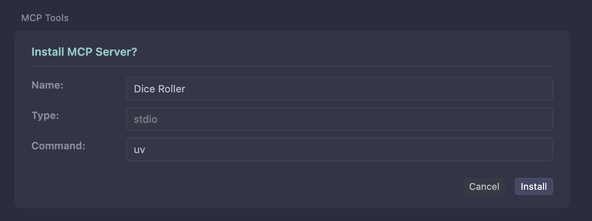

import { VersionBadge } from "/snippets/version-badge.mdx"
import { LocalFocusTip } from "/snippets/local-focus.mdx"

<LocalFocusTip />

Cursor supports MCP servers through multiple transport methods including STDIO, SSE, and Streamable HTTP, allowing you to extend Cursor's AI assistant with custom tools, resources, and prompts from your FastMCP servers.

## Requirements

This integration uses STDIO transport to run your FastMCP server locally. For remote deployments, you can run your FastMCP server with HTTP or SSE transport and configure it directly in Cursor's settings.

## Create a Server

The examples in this guide will use the following simple dice-rolling server, saved as `server.py`.

```python server.py
import random
from fastmcp import FastMCP

mcp = FastMCP(name="Dice Roller")

@mcp.tool
def roll_dice(n_dice: int) -> list[int]:
    """Roll `n_dice` 6-sided dice and return the results."""
    return [random.randint(1, 6) for _ in range(n_dice)]

if __name__ == "__main__":
    mcp.run()
```

## Install the Server

### FastMCP CLI
<VersionBadge version="2.10.3" />

The easiest way to install a FastMCP server in Cursor is using the `fastmcp install cursor` command. This automatically handles the configuration, dependency management, and opens Cursor with a deeplink to install the server.

```bash
fastmcp install cursor server.py
```

The install command supports the same `file.py:object` notation as the `run` command. If no object is specified, it will automatically look for a FastMCP server object named `mcp`, `server`, or `app` in your file:

```bash
# These are equivalent if your server object is named 'mcp'
fastmcp install cursor server.py
fastmcp install cursor server.py:mcp

# Use explicit object name if your server has a different name
fastmcp install cursor server.py:my_custom_server
```

After running the command, Cursor will open automatically and prompt you to install the server. The command will be `uv`, which is expected as this is a Python STDIO server. Click "Install" to confirm:



#### Dependencies

If your server has dependencies, include them with the `--with` flag:

```bash
fastmcp install cursor server.py --with pandas --with requests
```

Alternatively, you can specify dependencies directly in your server code:

```python server.py
from fastmcp import FastMCP

mcp = FastMCP(
    name="Dice Roller",
    dependencies=["pandas", "requests"]
)
```

#### Environment Variables

<Warning>
Cursor runs servers in a completely isolated environment with no access to your shell environment or locally installed applications. You must explicitly pass any environment variables your server needs.
</Warning>

If your server needs environment variables (like API keys), you must include them:

```bash
fastmcp install cursor server.py --name "Weather Server" \
  --env-var API_KEY=your-api-key \
  --env-var DEBUG=true
```

Or load them from a `.env` file:

```bash
fastmcp install cursor server.py --name "Weather Server" --env-file .env
```

<Warning>
**`uv` must be installed and available in your system PATH**. Cursor runs in its own isolated environment and needs `uv` to manage dependencies.
</Warning>

### Generate MCP JSON

<Note>
**Use the first-class integration above for the best experience.** The MCP JSON generation is useful for advanced use cases, manual configuration, or integration with other tools.
</Note>

You can generate MCP JSON configuration for manual use:

```bash
# Generate configuration and output to stdout
fastmcp install mcp-json server.py --name "Dice Roller" --with pandas

# Copy configuration to clipboard for easy pasting
fastmcp install mcp-json server.py --name "Dice Roller" --copy
```

This generates the standard `mcpServers` configuration format that can be used with any MCP-compatible client.

### Manual Configuration

For more control over the configuration, you can manually edit Cursor's configuration file. The configuration file is located at:
- **All platforms**: `~/.cursor/mcp.json`

The configuration file is a JSON object with a `mcpServers` key, which contains the configuration for each MCP server.

```json
{
  "mcpServers": {
    "dice-roller": {
      "command": "python",
      "args": ["path/to/your/server.py"]
    }
  }
}
```

After updating the configuration file, your server should be available in Cursor.

#### Dependencies

If your server has dependencies, you can use `uv` or another package manager to set up the environment.

```json
{
  "mcpServers": {
    "dice-roller": {
      "command": "uv",
      "args": [
        "run",
        "--with", "pandas",
        "--with", "requests", 
        "python",
        "path/to/your/server.py"
      ]
    }
  }
}
```

<Warning>
**`uv` must be installed and available in your system PATH**. Cursor runs in its own isolated environment and needs `uv` to manage dependencies.
</Warning>

#### Environment Variables

You can also specify environment variables in the configuration:

```json
{
  "mcpServers": {
    "weather-server": {
      "command": "python",
      "args": ["path/to/weather_server.py"],
      "env": {
        "API_KEY": "your-api-key",
        "DEBUG": "true"
      }
    }
  }
}
```

<Warning>
Cursor runs servers in a completely isolated environment with no access to your shell environment or locally installed applications. You must explicitly pass any environment variables your server needs.
</Warning>

## Using the Server

Once your server is installed, you can start using your FastMCP server with Cursor's AI assistant.

Try asking Cursor something like:

> "Roll some dice for me"

Cursor will automatically detect your `roll_dice` tool and use it to fulfill your request, returning something like:

> 🎲 Here are your dice rolls: 4, 6, 4
> 
> You rolled 3 dice with a total of 14! The 6 was a nice high roll there!

The AI assistant can now access all the tools, resources, and prompts you've defined in your FastMCP server.