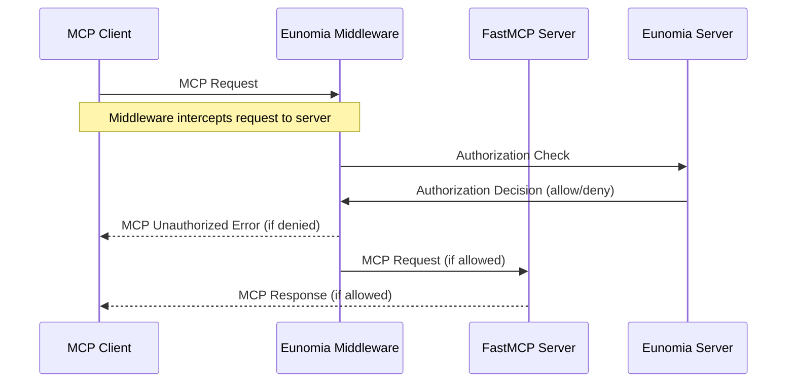

Add **policy-based authorization** to your FastMCP servers with minimal code changes using Eunomia authorization middleware.

Control which actions MCP clients can perform on your server by restricting how the agent can access resources, tools and prompts by using JSON-based policies, while obtaining a comprehensive audit log of all access attempts and violations.

## Eunomia Authorization Middleware

The middleware intercepts all MCP requests to your server and automatically maps MCP methods to authorization checks.



<Note>
Eunomia is an AI-specific standalone authorization server that handles policy decisions. You must have an Eunomia server running alongside your FastMCP server for the middleware to function.

Run it in the background with Docker:

```bash
docker run -d -p 8000:8000 ttommitt/eunomia-server:latest
```

</Note>

### Create a Server with Authorization

First, install the `eunomia-mcp` package:

```bash
pip install eunomia-mcp
```

Then create a FastMCP server and add the Eunomia middleware with a few lines of code:

```python server.py
from fastmcp import FastMCP
from eunomia_mcp import create_eunomia_middleware

mcp = FastMCP("Secure FastMCP Server 🔒")

@mcp.tool()
def add(a: int, b: int) -> int:
    """Add two numbers"""
    return a + b

middleware = [create_eunomia_middleware()]
app = mcp.http_app(middleware=middleware)

if __name__ == "__main__":
    import uvicorn
    uvicorn.run(app, host="0.0.0.0", port=8080)
```

### Configure Access Policies

Use the `eunomia-mcp` CLI in your terminal to manage your authorization policies:

```bash
# Create a default policy configuration file
eunomia-mcp init
```

This creates a policy file you can customize to control access to your MCP tools and resources.

```bash
# Once ready, validate your policy
eunomia-mcp validate mcp_policies.json

# And push it to the Eunomia server
eunomia-mcp push mcp_policies.json
```

### Run the Server

Start your FastMCP server normally:

```bash
python server.py
```

The middleware will now intercept all MCP requests and check them against your policies. Requests include agent identification through headers like `X-Agent-ID`, `X-User-ID`, or `Authorization` and an automatic mapping of MCP methods to authorization resources and actions.

<Tip>
  For detailed policy configuration, custom authentication, and advanced
  deployment patterns, visit the [Eunomia MCP Middleware
  repository][eunomia-github].
</Tip>

[eunomia-github]: https://github.com/whataboutyou-ai/eunomia/tree/main/pkgs/extensions/mcp
