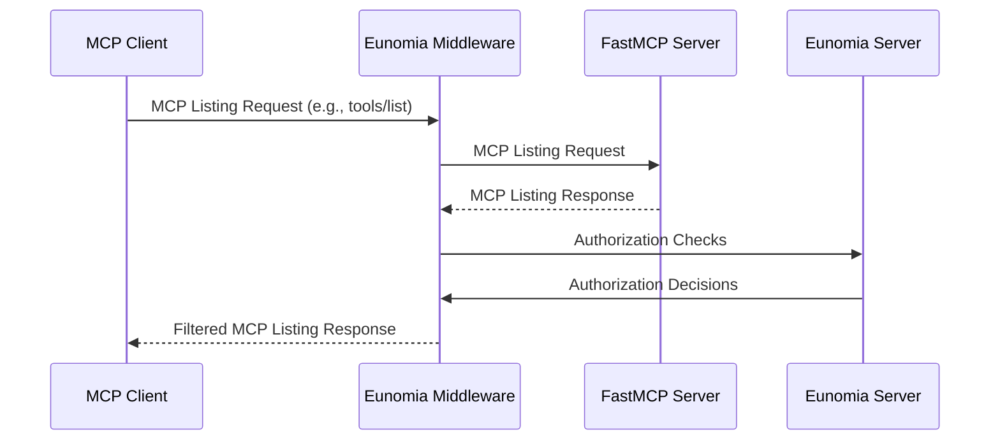
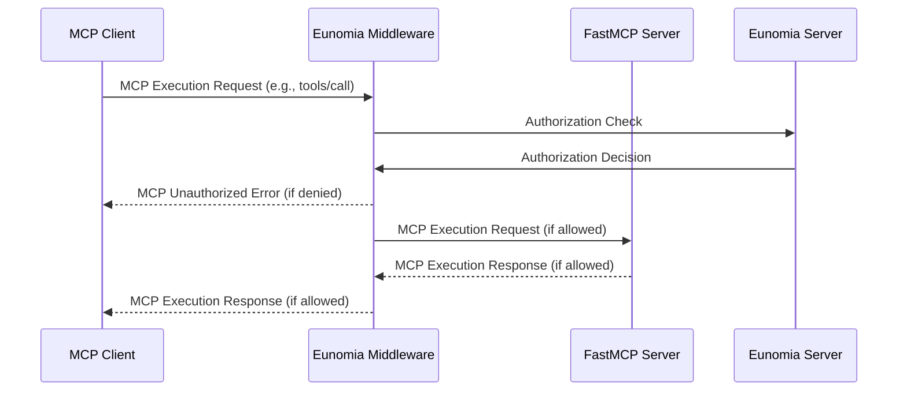

Add **policy-based authorization** to your FastMCP servers with one-line code addition with the **[Eunomia][eunomia-github] authorization middleware**.

Control which tools, resources and prompts MCP clients can view and execute on your server. Define dynamic JSON-based policies and obtain a comprehensive audit log of all access attempts and violations.

## How it Works

Exploiting FastMCP's [Middleware][fastmcp-middleare], the Eunomia middleware intercepts all MCP requests to your server and, then, automatically maps MCP methods to authorization checks.

### Listing Operations

The middleware behaves as a filter for listing operations (`tools/list`, `resources/list`, `prompts/list`), hiding to the client components that are not authorized by the defined policies.



### Execution Operations

The middleware behaves as a firewall for execution operations (`tools/call`, `resources/read`, `prompts/get`), blocking operations that are not authorized by the defined policies.



## Add Authorization to Your Server

<Note>
Eunomia is an AI-specific standalone authorization server that handles policy decisions. You must have an Eunomia server running alongside your FastMCP server for the middleware to function.

Run it in the background with Docker:

```bash
docker run -d -p 8000:8000 ttommitt/eunomia-server:latest
```

</Note>

### Create a Server with Authorization

First, install the `eunomia-mcp` package:

```bash
pip install eunomia-mcp
```

Then create a FastMCP server and add the Eunomia middleware in one line:

```python server.py
from fastmcp import FastMCP
from eunomia_mcp import EunomiaMcpMiddleware

mcp = FastMCP("Secure FastMCP Server 🔒")

@mcp.tool()
def add(a: int, b: int) -> int:
    """Add two numbers"""
    return a + b

middleware = EunomiaMcpMiddleware()
app = mcp.add_middleware(middleware)

if __name__ == "__main__":
    mcp.run()
```

### Configure Access Policies

Use the `eunomia-mcp` CLI in your terminal to manage your authorization policies:

```bash
# Create a default policy configuration file
eunomia-mcp init
```

This creates a policy file you can customize to control access to your MCP tools and resources.

```bash
# Once ready, validate your policy
eunomia-mcp validate mcp_policies.json

# And push it to the Eunomia server
eunomia-mcp push mcp_policies.json
```

### Run the Server

Start your FastMCP server normally:

```bash
python server.py
```

The middleware will now intercept all MCP requests and check them against your policies. Requests include agent identification through headers like `X-Agent-ID`, `X-User-ID`, `User-Agent`, or `Authorization` and an automatic mapping of MCP methods to authorization resources and actions.

<Tip>
  For detailed policy configuration, custom authentication, and advanced
  deployment patterns, visit the [Eunomia MCP Middleware
  repository][eunomia-mcp-github].
</Tip>

[eunomia-github]: https://github.com/whataboutyou-ai/eunomia
[eunomia-mcp-github]: https://github.com/whataboutyou-ai/eunomia/tree/main/pkgs/extensions/mcp
[fastmcp-middleare]: /servers/middleware
