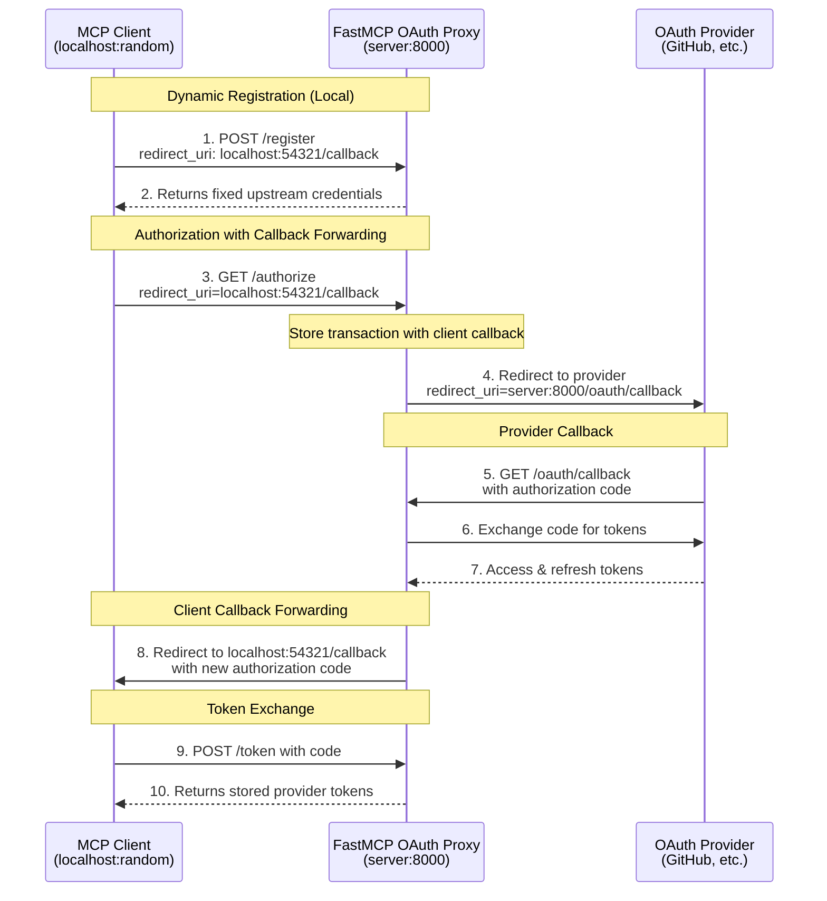

import { VersionBadge } from "/snippets/version-badge.mdx"

<VersionBadge version="2.12.0" />

OAuth Proxy enables your FastMCP server to authenticate with OAuth providers that **don't support Dynamic Client Registration (DCR)**. This includes virtually all traditional OAuth providers: GitHub, Google, Azure, Facebook, Discord, and most enterprise identity systems.

While MCP clients expect to dynamically register and obtain credentials, these providers require manual app registration through their developer consoles. OAuth Proxy bridges this gap by presenting a DCR-compliant interface to MCP clients while using your pre-registered credentials with the upstream provider.

<Tip>
**When to use OAuth Proxy vs RemoteAuthProvider:**
- **OAuth Proxy**: For providers WITHOUT Dynamic Client Registration (GitHub, Google, Azure, etc.)
- **RemoteAuthProvider**: For providers WITH Dynamic Client Registration (WorkOS AuthKit, etc.)

OAuth Proxy makes traditional OAuth providers work seamlessly with MCP's automated authentication flow.
</Tip>

## DCR vs Non-DCR Providers

The key distinction in MCP authentication is whether your OAuth provider supports **Dynamic Client Registration (DCR)**:

- **Providers WITH DCR** (WorkOS, some OIDC providers): Use [`RemoteAuthProvider`](/servers/auth/remote-oauth)
  - Clients can register themselves automatically
  - No manual app registration needed
  - True dynamic authentication flow

- **Providers WITHOUT DCR** (GitHub, Google, Azure, Discord, etc.): Use `OAuthProxy` (this guide)
  - Requires manual app registration in provider's console
  - You obtain fixed client ID and secret
  - OAuth Proxy bridges the gap for MCP compatibility

OAuth Proxy makes non-DCR providers work seamlessly with MCP by implementing a local DCR interface that always returns your pre-registered credentials.

## Understanding the DCR Gap

**Dynamic Client Registration (DCR)** allows OAuth clients to automatically register themselves with an authorization server and obtain credentials without manual intervention. The MCP specification is designed around this capability, expecting clients to register dynamically.

However, most OAuth providers don't support DCR:

| Provider Type | DCR Support | Registration Method | Examples |
|--------------|-------------|--------------------|-----------|
| Modern Auth Platforms | ✅ Yes | Automatic via API | WorkOS AuthKit, Some OIDC providers |
| Traditional OAuth | ❌ No | Manual via console | GitHub, Google, Azure, Discord, Facebook |
| Enterprise SSO | ❌ No | IT Administrator | Okta, AD FS, PingIdentity |

Providers without DCR require you to:
- Manually register applications through their developer console
- Obtain fixed client IDs and secrets that never change
- Pre-configure specific redirect URIs
- Manage credentials through their web interface

This creates a fundamental incompatibility: MCP clients expect to call a registration endpoint and receive credentials, but traditional providers only work with pre-registered apps. OAuth Proxy solves this by accepting any client registration request and returning your fixed upstream credentials.

## How OAuth Proxy Works

The OAuth Proxy implements an intelligent callback forwarding pattern that solves both the DCR problem and the redirect URI mismatch issue:



### The Callback Forwarding Pattern

OAuth Proxy implements an innovative callback forwarding pattern that solves the redirect URI mismatch problem:

**The Challenge:**
- MCP clients listen on random localhost ports (e.g., `http://localhost:54321/callback`)
- Each client session uses a different port
- OAuth providers only accept pre-registered, fixed redirect URIs
- Registering every possible localhost port is impossible

**The Solution:**

The proxy acts as an intermediary callback handler:

1. **Dynamic Registration**: Client provides its localhost callback URL during registration
2. **Transaction Tracking**: Proxy stores the client's callback URL with a transaction ID
3. **Fixed Provider Callback**: Proxy uses its own fixed callback URL with the provider
4. **Server-Side Token Exchange**: Proxy receives the provider's callback and exchanges the authorization code for tokens
5. **Client Forwarding**: Proxy redirects to the client's original localhost callback with a new authorization code
6. **Token Delivery**: Client exchanges this new code with the proxy to receive the provider's tokens

This pattern maintains full OAuth 2.1 security (including PKCE) while enabling dynamic client ports to work with fixed provider callbacks. The client never knows it's talking to a proxy - it experiences a standard DCR flow.

## Basic Implementation

The `OAuthProxy` class provides the complete proxy implementation:

<Card icon="code" title="OAuthProxy Constructor Parameters">
<ParamField body="upstream_authorization_endpoint" type="str" required>
  URL of your OAuth provider's authorization endpoint (e.g., `https://github.com/login/oauth/authorize`)
</ParamField>

<ParamField body="upstream_token_endpoint" type="str" required>
  URL of your OAuth provider's token endpoint (e.g., `https://github.com/login/oauth/access_token`)
</ParamField>

<ParamField body="upstream_client_id" type="str" required>
  Client ID from your registered OAuth application
</ParamField>

<ParamField body="upstream_client_secret" type="str" required>
  Client secret from your registered OAuth application
</ParamField>

<ParamField body="token_verifier" type="TokenVerifier" required>
  A [`TokenVerifier`](/servers/auth/token-verification) instance to validate the provider's tokens
</ParamField>

<ParamField body="base_url" type="AnyHttpUrl | str" required>
  Public URL of your FastMCP server (e.g., `https://your-server.com`)
</ParamField>

<ParamField body="redirect_path" type="str" default="/oauth/callback">
  Path for OAuth callbacks. Must match the redirect URI configured in your OAuth application
</ParamField>

<ParamField body="upstream_revocation_endpoint" type="str | None">
  Optional URL of provider's token revocation endpoint
</ParamField>

<ParamField body="issuer_url" type="AnyHttpUrl | str | None">
  Issuer URL for OAuth metadata (defaults to base_url)
</ParamField>

<ParamField body="service_documentation_url" type="AnyHttpUrl | str | None">
  Optional URL to your service documentation
</ParamField>

<ParamField body="resource_server_url" type="AnyHttpUrl | str | None">
  Resource server URL (defaults to base_url)
</ParamField>
</Card>

```python
from fastmcp import FastMCP
from fastmcp.server.auth.proxy import OAuthProxy
from fastmcp.server.auth.providers.jwt import JWTVerifier

# Configure token validation for your provider
token_verifier = JWTVerifier(
    jwks_uri="https://your-provider.com/.well-known/jwks.json",
    issuer="https://your-provider.com",
    audience="your-app-id"
)

# Create the OAuth proxy (accepts strings for URLs)
auth = OAuthProxy(
    # Upstream provider endpoints
    upstream_authorization_endpoint="https://your-provider.com/oauth/authorize",
    upstream_token_endpoint="https://your-provider.com/oauth/token",
    
    # Your registered app credentials
    upstream_client_id="your-registered-client-id",
    upstream_client_secret="your-registered-client-secret",
    
    # Token validation
    token_verifier=token_verifier,
    
    # Your FastMCP server URL (string automatically converted to AnyHttpUrl)
    base_url="https://your-server.com",
    
    # Optional: customize callback path (defaults to "/oauth/callback")
    redirect_path="/oauth/callback"
)

mcp = FastMCP(name="My Server", auth=auth)
```

### OAuth Provider Configuration

When registering your application with your OAuth provider, configure the redirect/callback URL as:

```
https://your-server.com/oauth/callback
```

For local development with providers that support it (like GitHub):

```
http://localhost:8000/oauth/callback
```

The proxy automatically:
- Implements DCR by returning your fixed credentials to any client that registers
- Handles callback forwarding between dynamic client callbacks and your fixed provider callback
- Exchanges authorization codes server-side for enhanced security
- Validates tokens using your provider's public keys or API
- Maintains PKCE security throughout the flow

## Client Compatibility

<Tip>
The OAuth Proxy's callback forwarding enables **any MCP client** to authenticate with **any OAuth provider**, regardless of redirect URI restrictions. Clients can use dynamic localhost ports while providers see their expected fixed callbacks.
</Tip>

This breakthrough means that MCP clients no longer need to worry about registering specific callback URLs with OAuth providers. The proxy handles the complexity of bridging dynamic client callbacks with the fixed URLs that providers require. The entire flow maintains OAuth 2.1 and PKCE (RFC-7636) compliance for security.

## Token Verification Strategies

Different OAuth providers use different token formats, requiring appropriate verification strategies:

### Provider Token Types

| Provider | Token Type | Verification Method | Built-in Support |
|----------|-----------|--------------------|-----------------|
| GitHub | Opaque | API validation (`/user` endpoint) | ✅ `GitHubProvider` |
| Google | JWT | JWKS signature verification | ✅ `GoogleProvider` |
| Azure AD | JWT | JWKS signature verification | Configure `JWTVerifier` |
| Discord | Opaque | API validation | ✅ `DiscordOAuthProxyProvider` |
| Custom | Varies | Implement `TokenVerifier` | Extend base class |

### Using Built-in Providers

FastMCP includes pre-configured providers that handle token verification automatically:

```python
from fastmcp.server.auth.providers.github import GitHubProvider

# GitHub provider with automatic API-based token validation
auth = GitHubProvider(
    client_id="your-github-client-id",
    client_secret="your-github-client-secret",
    base_url="https://your-server.com"
)
```

### Custom Token Verification

For providers without built-in support, implement a [`TokenVerifier`](/servers/auth/token-verification):

- **JWT tokens**: Use `JWTVerifier` with the provider's JWKS endpoint
- **Opaque tokens**: Extend `TokenVerifier` to validate via the provider's API
- **Hybrid approaches**: Combine multiple verification methods as needed

## Environment Configuration

OAuth Proxy supports environment-based configuration for production deployments:

```bash
# Provider selection
export FASTMCP_SERVER_AUTH=OAUTH_PROXY

# OAuth endpoints
export FASTMCP_SERVER_AUTH_OAUTH_PROXY_UPSTREAM_AUTHORIZATION_ENDPOINT="https://github.com/login/oauth/authorize"
export FASTMCP_SERVER_AUTH_OAUTH_PROXY_UPSTREAM_TOKEN_ENDPOINT="https://github.com/login/oauth/access_token"

# Credentials (use secrets management in production)
export FASTMCP_SERVER_AUTH_OAUTH_PROXY_UPSTREAM_CLIENT_ID="Ov23li..."
export FASTMCP_SERVER_AUTH_OAUTH_PROXY_UPSTREAM_CLIENT_SECRET="abc123..."

# Token validation
export FASTMCP_SERVER_AUTH_OAUTH_PROXY_TOKEN_VERIFIER="JWT"
export FASTMCP_SERVER_AUTH_OAUTH_PROXY_JWKS_URI="https://provider.com/.well-known/jwks.json"
export FASTMCP_SERVER_AUTH_OAUTH_PROXY_ISSUER="https://provider.com"
export FASTMCP_SERVER_AUTH_OAUTH_PROXY_AUDIENCE="your-app-id"

# Server URL
export FASTMCP_SERVER_AUTH_OAUTH_PROXY_BASE_URL="https://your-server.com"
```

With environment variables configured, your code becomes:

```python
from fastmcp import FastMCP

# Authentication automatically configured from environment
mcp = FastMCP(name="My Server")
```