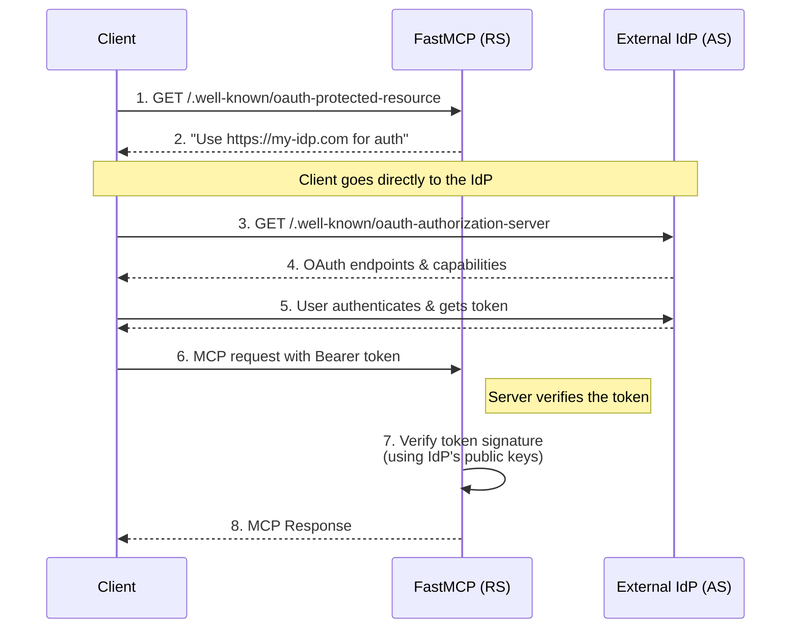

import { VersionBadge } from "/snippets/version-badge.mdx"

<VersionBadge version="2.11.0" />

**Remote OAuth** is the recommended pattern for securing most production applications. In this model, your FastMCP server acts as a **Resource Server (RS)** and integrates with an external, trusted **Authorization Server (AS)**, such as WorkOS, Auth0, or a corporate SSO system.

This approach lets you leverage robust, feature-rich identity platforms for user management, multi-factor authentication, and social logins, while your FastMCP server focuses on its core job: providing tools and resources.

### How It Works

The flow relies on the MCP client's ability to discover your server's authentication requirements. Your server doesn't handle logins itself; it tells the client where to find the real identity provider.

The key endpoint is **`/.well-known/oauth-protected-resource`** which returns static metadata pointing to the authorization server. You can optionally also provide **`/.well-known/oauth-authorization-server`** that forwards the authorization server's metadata for convenience.



## Building a Custom Provider

To connect to any identity provider, you create a custom `AuthProvider` subclass. This class has two main responsibilities:

1.  **Verifying Tokens:** Validate tokens issued by the external provider.
2.  **Forwarding Metadata:** Tell MCP clients where to find the external provider's login pages and token endpoints.

### Step 1: Verifying Tokens

Your provider must implement the `verify_token` method. For most modern identity providers that issue JWTs, you can simply delegate this task to FastMCP's built-in `JWTVerifier`.

```python
from fastmcp.server.auth.auth import AuthProvider
from fastmcp.server.auth.providers.jwt import JWTVerifier
from mcp.server.auth.provider import AccessToken

class MyIdPAuthProvider(AuthProvider):
    def __init__(self):
        super().__init__()
        # The verifier validates tokens from the upstream provider.
        self.token_verifier = JWTVerifier(
            jwks_uri="https://my-idp.com/.well-known/jwks.json",
            issuer="https://my-idp.com",
            audience="my-fastmcp-api"
        )

    async def verify_token(self, token: str) -> AccessToken | None:
        return await self.token_verifier.verify_token(token)
```

### Step 2: Adding Discovery Metadata

Next, implement the `customize_auth_routes` method. The essential endpoint is `/.well-known/oauth-protected-resource` which tells clients where to find your authorization server. You can optionally add the authorization server forwarding endpoint for convenience.

```python
import httpx
from starlette.responses import JSONResponse
from starlette.routing import Route

class MyIdPAuthProvider(AuthProvider):
    # ... (init and verify_token from above) ...
    
    def customize_auth_routes(self, routes: list[Route]) -> list[Route]:
        # Essential: Tell clients which authorization server to use
        async def protected_resource_metadata(request):
            return JSONResponse({
                "resource": "https://my-fastmcp-server.com",
                "authorization_servers": ["https://my-idp.com"],
                "bearer_methods_supported": ["header"],
            })
        
        routes.append(Route("/.well-known/oauth-protected-resource", protected_resource_metadata))
        
        # Optional: Forward the authorization server's metadata for convenience
        # (Clients can also fetch this directly from the IdP)
        async def authorization_server_metadata(request):
            async with httpx.AsyncClient() as client:
                resp = await client.get("https://my-idp.com/.well-known/oauth-authorization-server")
                resp.raise_for_status()
                return JSONResponse(resp.json())

        routes.append(Route("/.well-known/oauth-authorization-server", authorization_server_metadata))
        return routes
```

### Step 3: Using Your Provider

With these two methods implemented, your auth provider is now fully integrated with your identity provider. You can now use your custom provider with FastMCP by passing it to the `auth` parameter of your `FastMCP` instance:

```python
from fastmcp import FastMCP

mcp = FastMCP(name="My Secure Server", auth=MyIdPAuthProvider())
```


## Example: WorkOS AuthKit Provider

FastMCP provides a built-in provider for **WorkOS AuthKit** that handles this entire pattern for you. It's a perfect example of the remote OAuth pattern in action.

**Prerequisites:**
1. A WorkOS account with an AuthKit project.
2. **Dynamic Client Registration (DCR)** must be enabled in your WorkOS application settings.
3. Your FastMCP server's URL must be added as a **Redirect URI** in your WorkOS project (can be localhost for development).

```python
from fastmcp import FastMCP
from fastmcp.server.auth.providers.workos import AuthKitProvider

# The AuthKitProvider implements both metadata forwarding and token validation.
auth_provider = AuthKitProvider(
    # Your unique AuthKit domain from the WorkOS dashboard
    authkit_domain="https://your-project.authkit.app",
    # The URL of THIS FastMCP server (can be localhost for development)
    base_url="https://your-fastmcp-server.com"
)

mcp = FastMCP(name="My WorkOS-Protected Server", auth=auth_provider)
```

<Tip>
For a complete, step-by-step tutorial on using this provider, see the [**WorkOS AuthKit Integration Guide**](/integrations/authkit).
</Tip>