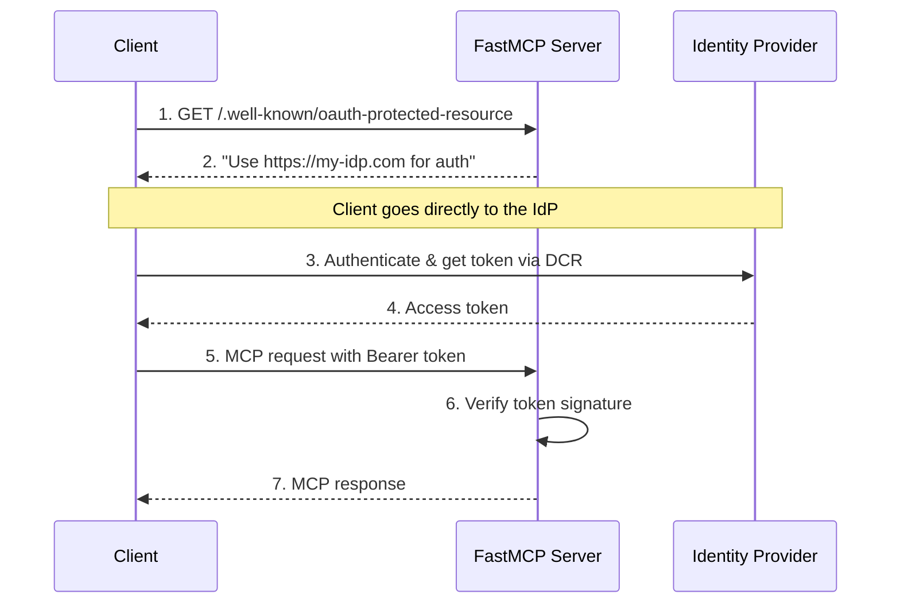

import { VersionBadge } from "/snippets/version-badge.mdx"

<VersionBadge version="2.11.0" />

Remote OAuth integration allows your FastMCP server to leverage external identity providers while maintaining the automated authentication flows that MCP clients require. This approach provides enterprise-grade authentication features without the complexity of implementing them yourself, making it the recommended pattern for most production applications.

<Tip>
Remote OAuth requires identity providers that support **Dynamic Client Registration (DCR)**. This enables MCP clients to automatically register and authenticate without manual configuration steps.
</Tip>

## The Remote OAuth Challenge

Traditional OAuth flows assume human users with web browsers who can interact with login forms, consent screens, and redirects. MCP clients operate differently - they're often automated systems that need to authenticate programmatically without human intervention.

This creates several unique requirements that standard OAuth implementations don't address well:

**Automatic Discovery**: MCP clients must discover authentication requirements by examining server metadata rather than encountering HTTP redirects. They need to know which identity provider to use and how to reach it before making any authenticated requests.

**Programmatic Registration**: Clients need to register themselves with identity providers automatically. Manual client registration doesn't work when clients might be dynamically created tools or services.

**Seamless Token Management**: Clients must obtain, store, and refresh tokens without user interaction. The authentication flow needs to work in headless environments where no human is available to complete OAuth consent flows.

**Protocol Integration**: The authentication process must integrate cleanly with MCP's JSON-RPC transport layer and error handling mechanisms.

These requirements mean that your MCP server needs to do more than just validate tokens - it needs to provide discovery metadata that enables MCP clients to understand and navigate your authentication requirements automatically.

## MCP Authentication Discovery

MCP authentication discovery relies on well-known endpoints that clients can examine to understand your authentication requirements. Your server becomes a bridge between MCP clients and your chosen identity provider.

The core discovery endpoint is `/.well-known/oauth-protected-resource`, which tells clients that your server requires OAuth authentication and identifies the authorization servers you trust. This endpoint contains static metadata that points clients to your identity provider without requiring any dynamic lookups.



This flow separates concerns cleanly: your MCP server handles resource protection and token validation, while your identity provider handles user authentication and token issuance. The client coordinates between these systems using standardized OAuth discovery mechanisms.

## FastMCP Remote Authentication

<VersionBadge version="2.11.1" />

FastMCP provides `RemoteAuthProvider` to handle the complexities of remote OAuth integration. This class combines token validation capabilities with the OAuth discovery metadata that MCP clients require.

### RemoteAuthProvider

`RemoteAuthProvider` works by composing a [`TokenVerifier`](/servers/auth/token-verification) with authorization server information. A `TokenVerifier` is another FastMCP authentication class that focuses solely on token validation - signature verification, expiration checking, and claim extraction. The `RemoteAuthProvider` takes that token validation capability and adds the OAuth discovery endpoints that enable MCP clients to automatically find and authenticate with your identity provider.

This composition pattern means you can use any token validation strategy (JWT verification, introspection endpoints, custom validation logic) while maintaining consistent OAuth discovery behavior. The separation allows you to change token validation approaches without affecting the client discovery experience.

The class automatically generates the required OAuth metadata endpoints using the MCP SDK's standardized route creation functions. This ensures compatibility with MCP clients while reducing the implementation complexity for server developers.

### Basic Implementation

Most applications can use `RemoteAuthProvider` directly without subclassing. The implementation requires a `TokenVerifier` instance, a list of trusted authorization servers, and your server's URL for metadata generation.

```python
from fastmcp import FastMCP
from fastmcp.server.auth import RemoteAuthProvider
from fastmcp.server.auth.providers.jwt import JWTVerifier
from pydantic import AnyHttpUrl

# Configure token validation for your identity provider
token_verifier = JWTVerifier(
    jwks_uri="https://auth.yourcompany.com/.well-known/jwks.json",
    issuer="https://auth.yourcompany.com",
    audience="mcp-production-api"
)

# Create the remote auth provider
auth = RemoteAuthProvider(
    token_verifier=token_verifier,
    authorization_servers=[AnyHttpUrl("https://auth.yourcompany.com")],
    resource_server_url="https://api.yourcompany.com"
)

mcp = FastMCP(name="Company API", auth=auth)
```

This configuration creates a server that accepts tokens issued by `auth.yourcompany.com` and provides the OAuth discovery metadata that MCP clients need. The `JWTVerifier` handles token validation using your identity provider's public keys, while the `RemoteAuthProvider` generates the required OAuth endpoints.

The `authorization_servers` list tells MCP clients which identity providers you trust. The `resource_server_url` identifies your server in OAuth metadata, enabling proper token audience validation.

### Custom Endpoints

You can extend `RemoteAuthProvider` to add additional endpoints beyond the standard OAuth protected resource metadata. These don't have to be OAuth-specific - you can add any endpoints your authentication integration requires.

```python
import httpx
from starlette.responses import JSONResponse
from starlette.routing import Route

class CompanyAuthProvider(RemoteAuthProvider):
    def __init__(self):
        token_verifier = JWTVerifier(
            jwks_uri="https://auth.yourcompany.com/.well-known/jwks.json",
            issuer="https://auth.yourcompany.com",
            audience="mcp-production-api"
        )
        
        super().__init__(
            token_verifier=token_verifier,
            authorization_servers=[AnyHttpUrl("https://auth.yourcompany.com")],
            resource_server_url="https://api.yourcompany.com"
        )
    
    def get_routes(self) -> list[Route]:
        """Add custom endpoints to the standard protected resource routes."""
        
        # Get the standard OAuth protected resource routes
        routes = super().get_routes()
        
        # Add authorization server metadata forwarding for client convenience
        async def authorization_server_metadata(request):
            async with httpx.AsyncClient() as client:
                response = await client.get(
                    "https://auth.yourcompany.com/.well-known/oauth-authorization-server"
                )
                response.raise_for_status()
                return JSONResponse(response.json())
        
        routes.append(
            Route("/.well-known/oauth-authorization-server", authorization_server_metadata)
        )
        
        return routes

mcp = FastMCP(name="Company API", auth=CompanyAuthProvider())
```

This pattern uses `super().get_routes()` to get the standard protected resource routes, then adds additional endpoints as needed. A common use case is providing authorization server metadata forwarding, which allows MCP clients to discover your identity provider's capabilities through your MCP server rather than contacting the identity provider directly.

## WorkOS AuthKit Integration

WorkOS AuthKit provides an excellent example of remote OAuth integration. The `AuthKitProvider` demonstrates how to implement both token validation and OAuth metadata forwarding in a production-ready package.

```python
from fastmcp import FastMCP
from fastmcp.server.auth.providers.workos import AuthKitProvider

auth = AuthKitProvider(
    authkit_domain="https://your-project.authkit.app",
    base_url="https://your-mcp-server.com"
)

mcp = FastMCP(name="Protected Application", auth=auth)
```

The `AuthKitProvider` automatically configures JWT validation against WorkOS's public keys and provides both protected resource metadata and authorization server metadata forwarding. This implementation handles the complete remote OAuth integration with minimal configuration.

WorkOS's support for Dynamic Client Registration makes it particularly well-suited for MCP applications. Clients can automatically register themselves with your WorkOS project and obtain the credentials needed for authentication without manual intervention.

→ **Complete WorkOS tutorial**: [AuthKit Integration Guide](/integrations/authkit)

## Implementation Considerations

Remote OAuth integration requires careful attention to several technical details that affect reliability and security.

**Token Validation Performance**: Your server validates every incoming token by checking signatures against your identity provider's public keys. Consider implementing key caching and rotation handling to minimize latency while maintaining security.

**Error Handling**: Network issues with your identity provider can affect token validation. Implement appropriate timeouts, retry logic, and graceful degradation to maintain service availability during identity provider outages.

**Audience Validation**: Ensure that tokens intended for your server are not accepted by other applications. Proper audience validation prevents token misuse across different services in your ecosystem.

**Scope Management**: Map token scopes to your application's permission model consistently. Consider how scope changes affect existing tokens and plan for smooth permission updates.

The complexity of these considerations reinforces why external identity providers are recommended over custom OAuth implementations. Established providers handle these technical details with extensive testing and operational experience.